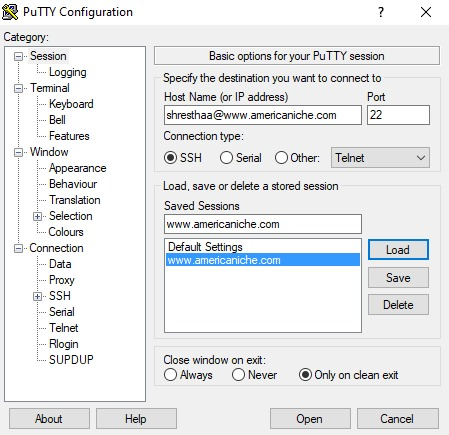
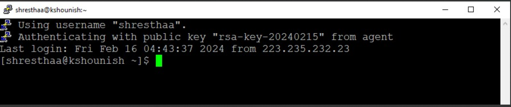
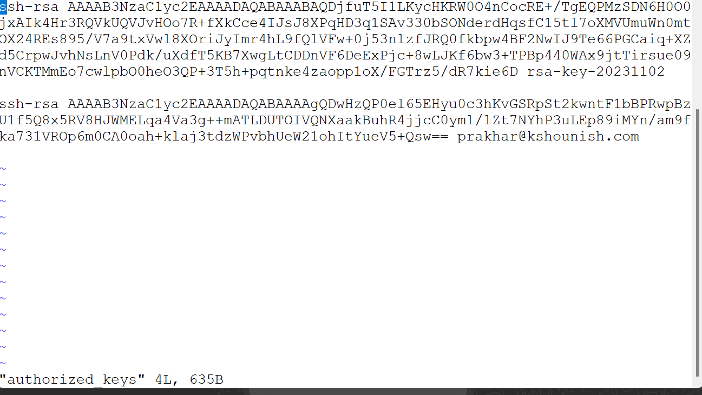
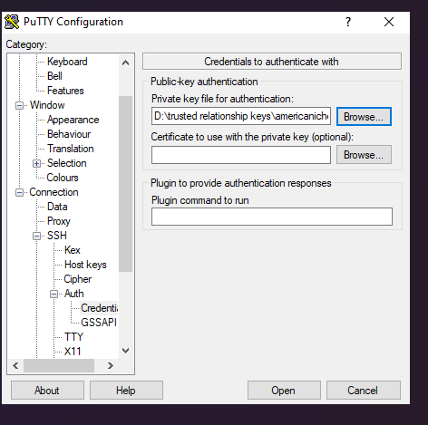

# DEPLOYMENT Methods

* At first go inside the sever with the help of putty

* Generate Your SSH Key Pair:
If you haven't already done so, generate your SSH key pair on your local machine using the ssh-keygen command. This command will create both a public key (usually named id_rsa.pub) and a private key (usually named id_rsa) in your ~/.ssh directory.

* Copy Your Public Key:
Open the public key file (id_rsa.pub) using a text editor or display its contents using the cat command. Copy the entire contents of the file.

* Connect to the SSH Server:
Use your preferred SSH client to connect to the SSH server where you want to add your public key. You will need to authenticate using your username and password (unless you already have a key pair set up for this server).

* Navigate to Your SSH Directory:
Once connected to the server via SSH, navigate to your .ssh directory. You can do this by running the following command:
cd ~/.ssh

* Edit the authorized_keys File:
If the authorized_keys file does not already exist, you can create it. Then, open the authorized_keys file using a text editor (such as nano or vi):
authorized_keys
If the file already exists, you can simply append your public key to the end of it.

* Paste Your Public Key:
Paste the contents of your public key into the authorized_keys file.

* Save and Exit:
After pasting your public key into the file, save your changes and exit the text editor.

* Set Correct Permissions (Important):
Ensure that the authorized_keys file has the correct permissions set. Use the following command to set the permissions:
chmod 600 authorized_keys
This command sets the permissions of the file to read and write for the user only.

* Test SSH Connection:
Disconnect from the server and then reconnect using SSH. If everything was set up correctly, you should be able to log in without being prompted for a password.

That's it! Your public key is now added to the authorized_keys file on the SSH server, allowing you to authenticate using your private key.

## SAVING private key  using PuTTYgen 
* In the 'Connection' -> 'SSH' -> 'Auth' category, browse and select the private key file you saved .
* Save these settings if you want to use them again in the future.
* Click 'Open' to establish the SSH connection to the server for keyless authentication.

