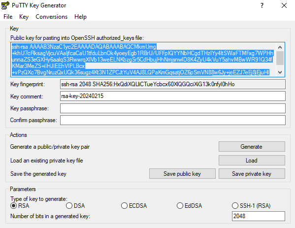

# To create public key and private key on the client and import public key

* Open PuTTYgen.
* Click on the 'Generate' button to create a new key pair.
* Follow the instructions to generate randomness by moving the mouse within the PuTTYgen window.
* Once the key pair is generated, you can set a passphrase to protect the private key (optional but recommended).
* Save the public and private keys to your local machine.

