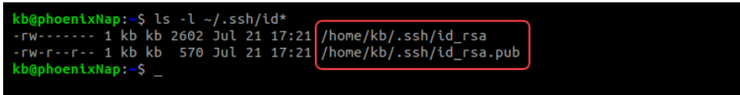
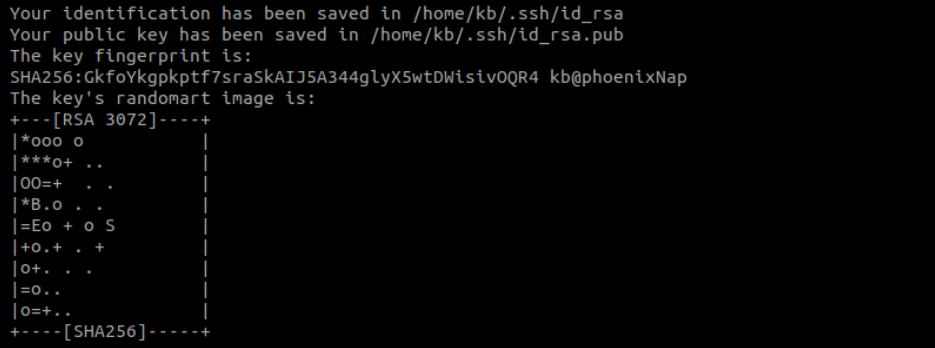
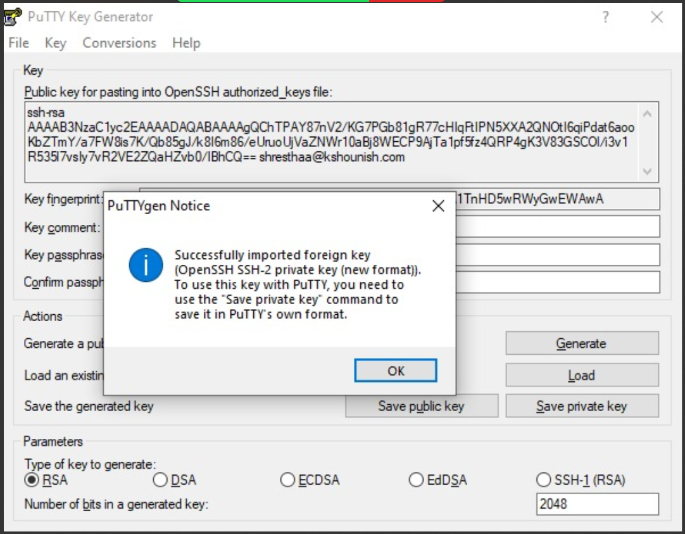

# Generation Of public Keys and private key

## There are two process of generating public key and private key
* Through ssh
* Through PuTTYgen.

## THROUGH SSH

### To generate SSH (Secure Shell) public and private key pairs, you typically use a command-line tool called ssh-keygen. This tool is available on most Unix-like operating systems (including Linux and macOS) and even on Windows if you're using software like Git Bash or Cygwin. Here's a step-by-step guide on how to generate SSH keys:

* Open a Terminal or Command Prompt:
Depending on your operating system, open a terminal window. On Unix-like systems, you can usually find the terminal in the applications menu. On Windows, you can use Git Bash if you have it installed, or you can use the regular Command Prompt.

* Run ssh-keygen command:
Type the following command in the terminal:
ssh-keygen -t rsa -b 4096 -C "your_email@example.com"
Replace "your_email@example.com" with your actual email address. This command generates an RSA key pair with 4096 bits of strength.

* Choose a Location for the Keys:
You'll be prompted to choose a location to save the keys. By default, they're usually saved in the .ssh directory within your home directory (~/.ssh on Unix-like systems or C:\Users\YourUsername\.ssh on Windows).

* View Your Public Key:
After generating the keys, you can view the public key by typing:

* Copy code
cat ~/.ssh/id_rsa.pub
Replace ~/.ssh/id_rsa.pub with the path to your public key if you chose a different location.

*  Copy Your Public Key:
Copy the entire contents of the public key, starting with ssh-rsa and ending with your email address.

* Add the Public Key to the Server:
Paste the copied public key into the ~/.ssh/authorized_keys file on the server you want to connect to. If the file doesn't exist, you can create it. Each public key should be on its own line in this file.

* Set Permissions (Optional but Recommended):
Set the correct permissions on the ~/.ssh directory and the ~/.ssh/authorized_keys file on the server:

* Copy code
chmod 600 ~/.ssh/authorized_keys
This ensures that only you can read and write to these files.

# THROUGH PuTTYgen

* Open PuTTYgen.
* Click on the 'Generate' button to create a new key pair.
* Follow the instructions to generate randomness by moving the mouse within the PuTTYgen window.
* Once the key pair is generated, you can set a passphrase to protect the private key (optional but recommended).
* Save the public and private keys to your local machine.

